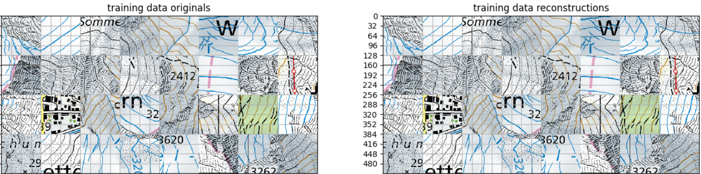

# Generative Experiments
This repo contains a number of approaches for generative modeling and is continuously updated as I work with new methods.

Currently, the main model is a VQVAE[0] along with a PixelCNN++ prior. I based my JAX implementation of VQVAE on [this](https://github.com/deepmind/dm-haiku/blob/b9e055f0ba98a9ce4055d588c95e08dda42c6e46/examples/vqvae_example.ipynb) notebook and trained it on a custom dataset containing topographic map tiles of Switzerland. PixelCNN was slightly adapted from here to work with learning the latent codes from VQVAE instead of RGB images.

  

Todos

- [ ] retrain PixelCNN++ for longer for better results

- [ ] conditional generation

- [ ] build web demo

WIP.

### References
[0] https://arxiv.org/abs/1711.00937

[1] https://arxiv.org/pdf/1701.05517.pdf

